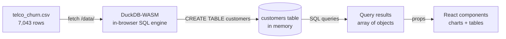
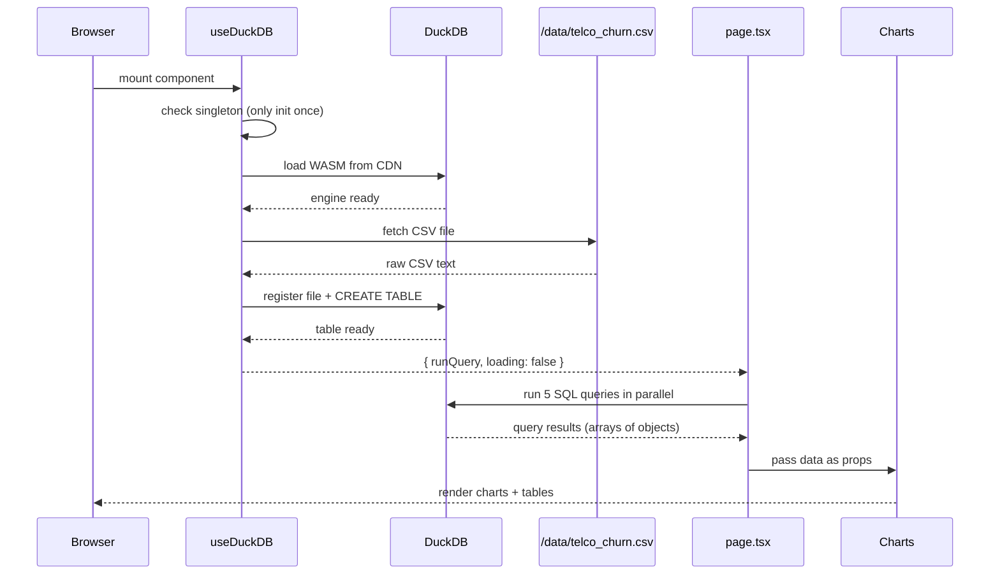
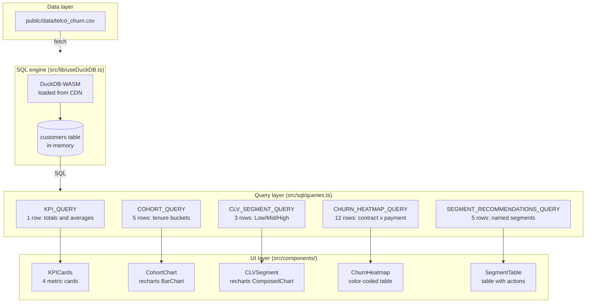

# Data flow: how charts get their data

This document shows how data moves from a static CSV file to interactive charts, all inside the browser.

## High-level flow

## Detailed step-by-step

## What each layer does

## Query-to-chart mapping

| Query | Returns | Component | Visual |
|-------|---------|-----------|--------|
| KPI_QUERY | 1 row, 4 metrics | KPICards | 4 number cards |
| COHORT_QUERY | 5 rows, one per tenure bucket | CohortChart | Bar chart, green gradient |
| CLV_SEGMENT_QUERY | 3 rows (Low/Mid/High) | CLVSegment | Bars (CLV) + line (churn %) |
| CHURN_HEATMAP_QUERY | 12 rows (3 contracts x 4 payments) | ChurnHeatmap | Color table, green to red |
| SEGMENT_RECOMMENDATIONS_QUERY | 5 named segments | SegmentTable | Table with action column |

## Key design decisions

1. **Singleton DuckDB**: the hook initializes once and shares the connection across re-renders. No duplicate WASM loads.
2. **CDN bundles**: WASM and worker files come from jsDelivr, not bundled with Next.js. Avoids webpack/turbopack issues with .wasm files.
3. **Blob worker**: the Web Worker script is fetched as text and loaded via a Blob URL to bypass cross-origin restrictions.
4. **Parallel queries**: all 5 queries run with `Promise.all` after DuckDB is ready. No waterfall.
5. **Pre-cleaned CSV**: TotalCharges blanks were replaced with "0" before commit, so DuckDB reads them as DOUBLE without runtime casting.
